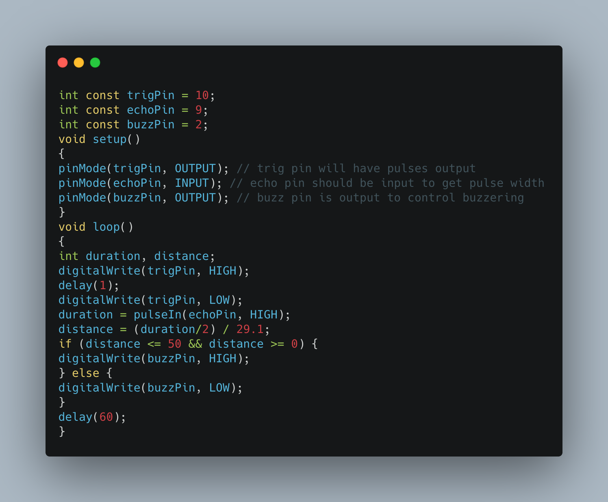

# Third eye for the Blind
I am working on a wearable device for the blind that uses ultrasonic waves to detect obstacles. The device notifies the user through vibrations and buzzers sounds.

| Engineer | School | Area of Interest | Grade |
|:--:|:--:|:--:|:--:|
| Rachit B. | Dougherty Valley High School | Computer Engineering | Incoming Senior

# Final Milestone
My final milestone is the increased reliability and accuracy of my robot. I ameliorated the sagging and fixed the reliability of the finger. As discussed in my second milestone, the arm sags because of weight. I put in a block of wood at the base to hold up the upper arm; this has reverberating positive effects throughout the arm. I also realized that the forearm was getting disconnected from the elbow servo’s horn because of the weight stress on the joint. Now, I make sure to constantly tighten the screws at that joint. 

{:target="_blank" rel="noopener"}

# Second Milestone
My final milestone is the increased reliability and accuracy of my robot. I ameliorated the sagging and fixed the reliability of the finger. As discussed in my second milestone, the arm sags because of weight. I put in a block of wood at the base to hold up the upper arm; this has reverberating positive effects throughout the arm. I also realized that the forearm was getting disconnected from the elbow servo’s horn because of the weight stress on the joint. Now, I make sure to constantly tighten the screws at that joint.

{:target="_blank" rel="noopener"}
# First Milestone

My first milestone was setting up the ultrasonic sensor and connecting it with the buzzer. In the video, I moved my hand towards the ultrasonic sensor to demonstrate how it uses the buzzer the inform whoever is wearing the device that an object is nearby. The purpose of this device is to help blind people navigate through the world a little easier. According to WHO, there are over 40 million blind people in the world, and this device can make their life a little easier.

{:target="_blank" rel="noopener"}

